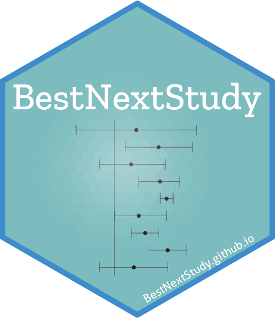

<p>&nbsp;</p> 
<p>&nbsp;</p> 
<center>

</center>


The R package `BestNextStudy` brings a friendly syntax to study

- how well have extant studies collectively contributed to our understanding of the focal association being studies in a meta-analysis at a given point in time
- how has our understanding of the focal association being studies in a meta-analysis evolved over time
- what should be the optimal next study to further our understanding of the focal association being studies in a meta-analysis

The [application](Application_CS_Retention.html) page demonstrates the use of `BestNextStudy` package to understand the association between Customer Satisfaction and Retention using sample data from Mittal et. al (2022).

The package is available on [GitHub](https://github.com/bestnextstudy/bestnextstudy){target="_blank"}  and can be installed to your local computer by running the following lines of code.

```{r load_packages , warning=FALSE , message = FALSE, }

# Installing `devtools` package if not alredy installed
if(!require(devtools)){
    install.packages("devtools")
    library(devtools)
}

#Installing `bestnextstudy` package
devtools::install_github("bestnextstudy/bestnextstudy")
library(bestnextstudy)
```

<p>&nbsp;</p> 
<p>&nbsp;</p> 

```{r setup, include=FALSE}
knitr::opts_chunk$set(echo = FALSE)
```

```{css}
d-title {
    display: none;
  }
```
